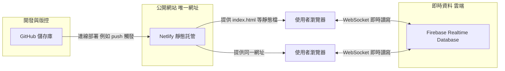

# 01 — 專案總覽

## 專案目的

讓同一「房間碼」下的多位使用者，在瀏覽器中即時同步各自「支持」的啦啦隊／女孩名單（以內建或可自訂的成員清單為主體），並提供：

- 個人勾選（我的選擇）
- 房間內多人名單比對（共同支持：交集／聯集兩種顯示方式）
- 房間成員與點擊檢視細節
- 簡易管理後台（房間／啦啦隊名單）

---

## 部署與同步架構（GitHub + Netlify + Firebase）

本專案實際運作方式可理解為三層分工；**不需要**自己租一台傳統「網站主機 + 資料庫主機」才能讓朋友同步使用。

| 層級 | 角色 | 與「大家同步、網站只有一個」的關係 |
|------|------|--------------------------------------|
| **GitHub** | 原始碼與歷史紀錄（`index.html`、`docs/`、`scripts/` 等） | 團隊協作、改版、PR；**不是**使用者日常開啟的網址。 |
| **Netlify** | 從 GitHub 取碼並發布 **靜態網站**（HTML/JS/CSS） | 產出 **單一正式網址**（例如 `*.netlify.app` 或自訂網域）；所有人書籤與分享都指向這裡，**前端版本統一**。 |
| **Firebase** | **Realtime Database** 存放房間與選擇等資料 | 所有人在同一網頁內輸入同一 **房間碼** 後，透過 RTDB **即時推送**更新；**不需**每人自己架 server。 |

### 資料流（概念）

1. 使用者在 **Netlify 上的同一個網址** 開啟應用（載入 `index.html`）。
2. 瀏覽器內的 JavaScript 用 **Firebase Web SDK** 連到專案設定的 `databaseURL`。
3. 進入房間後，程式 `listen` 例如 `rooms/{房間碼}/members`；任一人變更選擇會寫入 RTDB，其他人畫面 **自動更新**。

### 為什麼要拆成「一個網站 + 一個雲端資料庫」？

- **Netlify**：負責「**全世界看到同一版前端**」與 HTTPS、快取等靜態託管能力。
- **Firebase**：負責「**多人同時編輯仍一致**」的即時資料層；靜態主機本身不替你存房間狀態。

### 實務上你可能怎麼接線（給 AI／新同事的背景句）

> 程式在 GitHub；用 Netlify 連 GitHub 自動部署，得到唯一正式網址；Firebase 專案裡開 Realtime Database，並把 `FIREBASE_CONFIG` 寫在 `index.html`（與 Console 網域白名單、RTDB Rules 一併設定）。

---

## 技術型態（一句話）

**單一靜態頁** `index.html`：內含 CSS、Firebase compat SDK、React 18 UMD、以及一支大型內嵌 JavaScript（無打包工具、無 `npm` 建置步驟）。

適合 **Netlify / GitHub Pages / 任意靜態主機** 直接丟檔或 CI 部署。

## 儲存庫檔案地圖

| 路徑 | 說明 |
|------|------|
| `index.html` | 完整前端應用（樣式、邏輯、UI 全在此） |
| `cheerleader-app-default-rtdb-export.json` | Firebase Realtime Database 匯出範例／備份（含 `config/members` 與 `rooms` 等）；可用於還原或對照結構 |
| `cheerleader-app-default-rtdb-export_1.json` | 若存在，多為另一版匯出備份（以實際內容為準） |
| `scripts/check-inline.mjs` | 從 `index.html` 抽出內嵌腳本並做語法檢查（Node） |
| `docs/*.md` | 本專案架構與維運說明（給人與 AI） |

## 外部依賴（CDN）

- Firebase App + Realtime Database（compat）
- React 18 + ReactDOM 18（production UMD）

## 機密與部署注意

- `index.html` 內含 **Firebase Web 設定**（`apiKey` 等）：屬公開客戶端設定，但仍應以 **Firebase Console 的網域限制與 RTDB 規則** 控管濫用。
- **管理員密碼**目前為內嵌常數 `ADMIN_PASSWORD`：部署前務必修改；若需更安全作法，可改 Firebase Auth 等（見 `docs` 內其他討論或自行補「安全決策」一節）。

## 建議給 AI 的提示詞範例

> 這是單檔 React + Firebase RTDB 專案，主程式在 `index.html` 內嵌 `<script>`。程式碼在 GitHub、網站由 Netlify 發布成唯一網址、即時同步靠 Firebase。請先讀 `docs/README.md`、`docs/01-專案總覽.md`、`docs/03-Firebase與資料.md`，再針對我要改的「XXX」修改。
